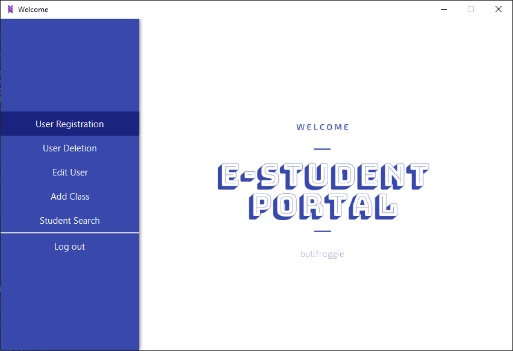

# E-Student-Project
Project for Object Oriented Programming I class (Freshman year)

This project is supposed to represent a **university related "portal/service"** where **students/professors/admins** can *view grades, register for exams, assess exams, annul exams, register users etc.*

# Getting Started
When you run the program in your IDE, it will compile, but you will receive an error that looks something like this: 
`Error: JavaFX runtime components are missing, and are required to run this application`.

GUI is made with JavaFX v11 which requires of you to add a VM argument for your launch configuration. The argument should look like this `--module-path "\path\to\javafx-sdk-11.0\lib" --add-modules javafx.controls,javafx.fxml`.
You can also replace the module path with the environment variable **PATH_TO_FX** if you add the path to *Eclipse -> Preferences -> Run/Debug -> String Substitution -> New.... *

If you get a JSON related error, you might want to delete the classpath for json and build a new path.

If you don't receive any of these errors, great! Then you should only navigate to the Main.java class and run it.

# Built With
JDK 11, JavaFX 11, CSS, and JSON

# Author
Nikola Lausev

# License
This project is licensed under the MIT License - see the LICENSE.md file for details
